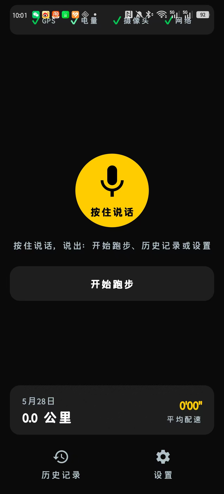
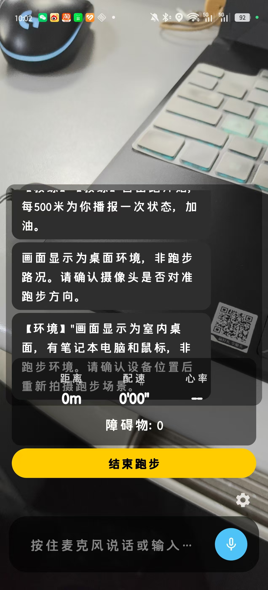

# Guide-running-for-the-visually-impaired

# 助盲跑 - 视障人士专业跑步辅助App

基于智能手机的语音交互跑步应用，为视障人群提供安全、独立的户外跑步支持。

## 核心特性
- 🎤 **语音控制**：尽可能减少视觉、触摸操作
- 🚧 **实时障碍检测**：摄像头AI预警，保障跑步安全
- 🏃 **专业运动反馈**：配速、步频、心率实时播报
- 📝 **智能计划与总结**：语音创建计划，跑后自动分析
- 🌧 **环境适应**：嘈杂环境降噪、低光手电

## 技术栈
- 语言：Kotlin
- UI 框架：Jetpack Compose (声明式 UI 架构)
- 最低SDK：Android 10 (API 29)
- 主要依赖：CameraX,千问 API (云端 AI 驱动), GPS 定位组件, SpeechRecognizer (语音识别), Hilt (依赖注入), Room (本地数据库)
- 架构：MVVM + Repository

## 开发状态
当前阶段：v1.0-release 已上线。实现“语音计划 - 实时反馈 - AI 语音路线通知 - 跑后大模型总结”的完整 MVP 闭环。

## 交付物下载与查看
**APK 下载链接**：[点击下载 app-debug.apk](./apk/app-debug.apk)
**演示视频链接**：[网盘分享](https://www.alipan.com/s/6oqcZR5ovZC)
## 核心功能截图
|  |  |

## 项目目录结构说明
guiderunningfortheblind/
├── ai/          # 🤖 AI 智能层：对接云端大语言模型，负责智能教练指导与场景分析
├── camera/      # 📷 视觉感知：基于 CameraX 的实时图像帧抓取与障碍物检测预警
├── data/        # 📦 核心数据层：Room 本地数据库 (DAO/Entity) 与统一的 Repository 仓库
├── di/          # 💉 依赖注入：基于 Hilt 的全局依赖注入配置 (AppModule)
├── location/    # 📍 定位服务：GPS 定位流获取与地图轨迹底层管理
├── speech/      # 🎤 语音交互层：全语音命令接收识别 (ASR) 与自研 TTS 播报队列调度
└── ui/          # 🎨 UI 表现层：基于 Jetpack Compose 的模块化界面与 ViewModel
    ├── components/ # 通用 UI 封装组件（如高德地图 View 桥接、Banner 提示等）
    ├── home/       # 首页模块 (Fragment / ViewModel)
    ├── plan/       # 智能跑步计划语音生成模块
    ├── running/    # 跑步中实时状态、AI 语音对话及跑后总结大模型分析模块
    └── history/    # 历史运动记录列表与轨迹详情展示

